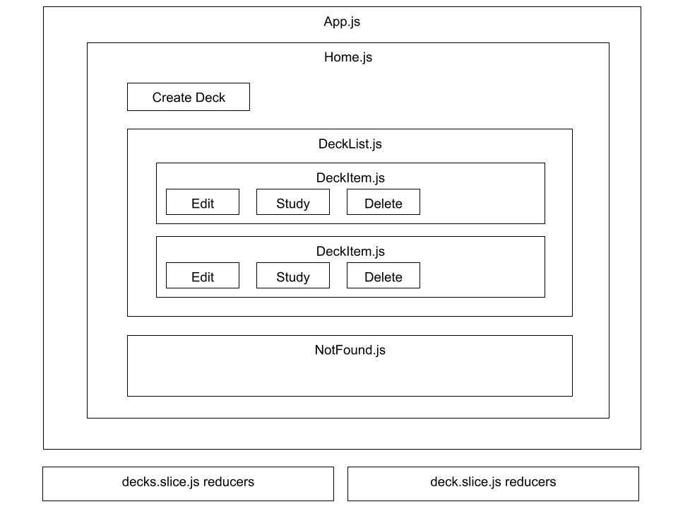
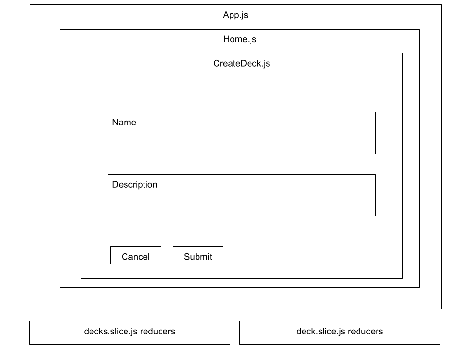
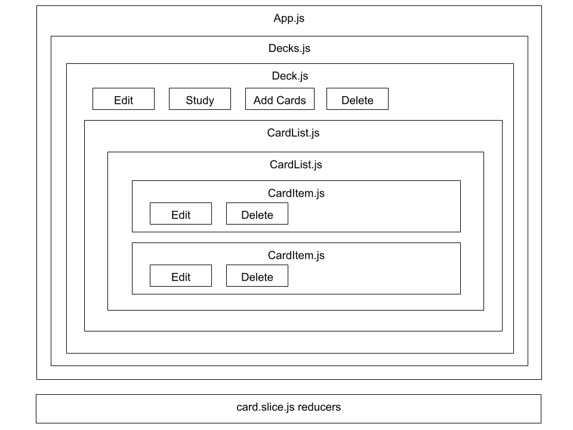
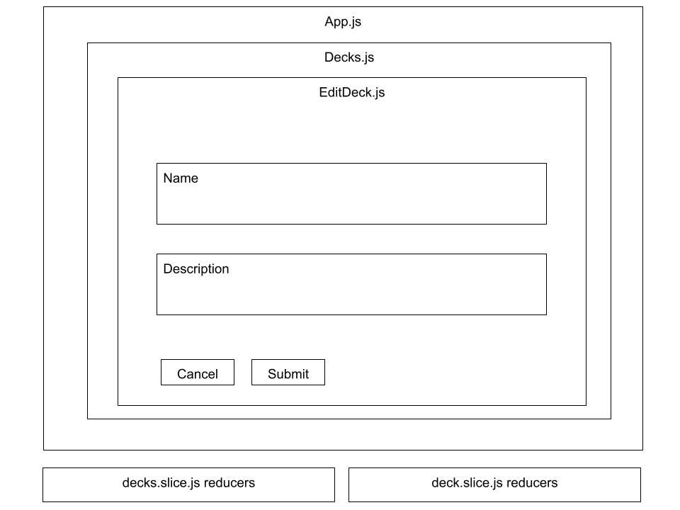
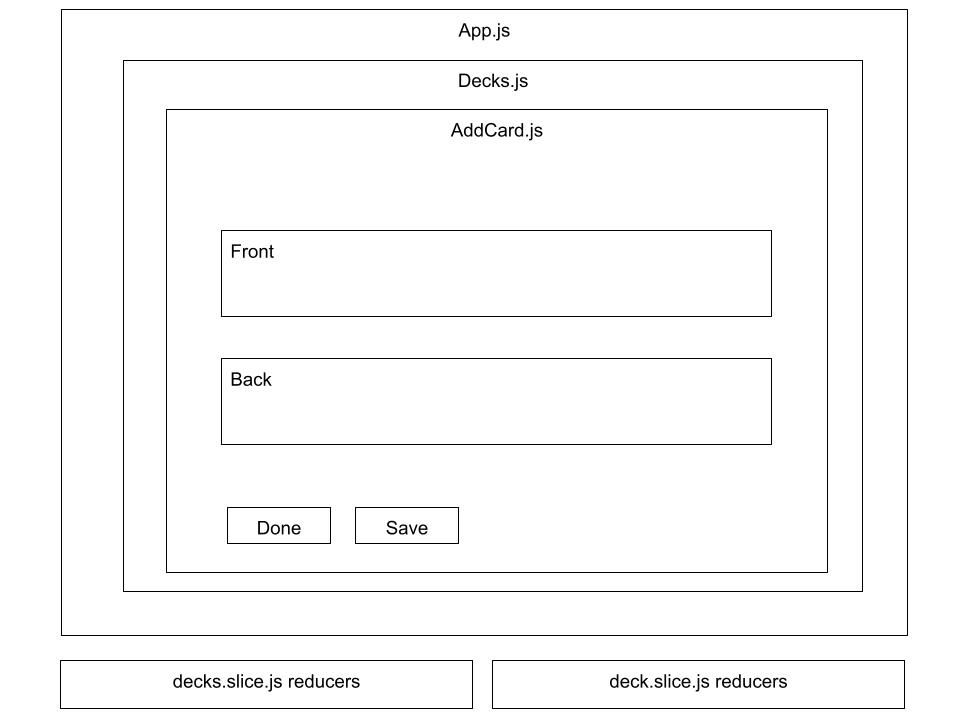
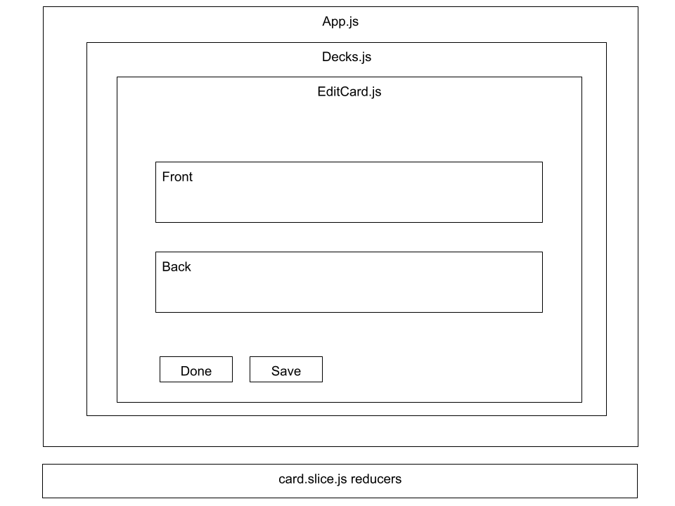

# chegg-frontend-final-capstone-flashcard-app
## Capstone project: Flashcard-o-matic

## Overview:

A local school has decided to put together a flashcard application, Flashcard-o-matic, to help their students study online. Teachers will use this application to create decks of flashcards for the subjects they teach, and students will study the decks. The school needs you to build the application that the students and teachers will use.

## Redux

Contains three different slice reducer files:

- decks.slice.js
- deck.slice.js
- card.slice.js

The reducers call the local JSON server REST API.

## Wireframes of React component structure

Home to Create Deck

Create Deck to Deck

Deck to Edit Deck

Deck to Add Card

Deck to Edit Card

## Running the application

1. Reset the database:

`npm run copydb`

2. Launch the Express server and REST API:

`npm run start:server`

3. Launch the React client UI:

`npm run start:react`

## Running the tests

`npm test`

